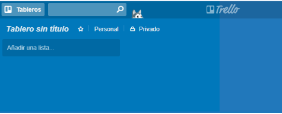
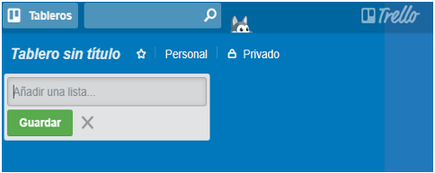
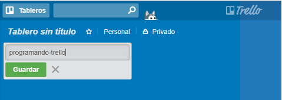
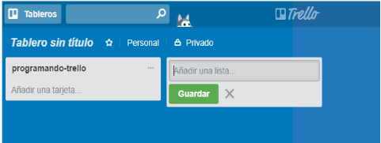
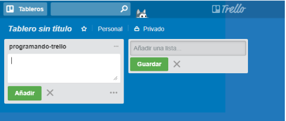
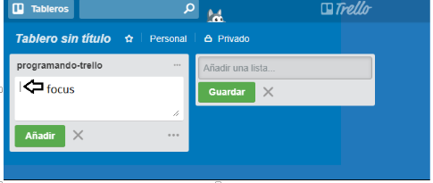
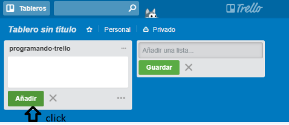
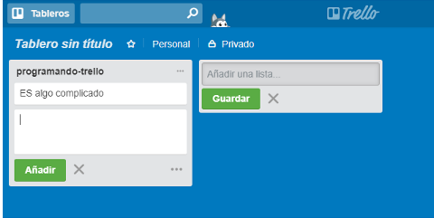
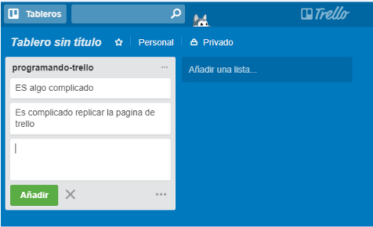
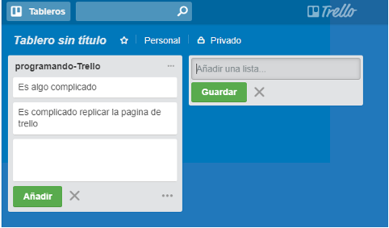

# **TRELLO**
## Instrucciones:
Este Programa replicará el tablero de Trello, para eso se seguirá el siguiente  flujo de versiones :


PARA VER EL SITIO ORIGINAL DA CLICK AQUI---->[PAGINA OFICIAL DE TRELLO](https://trello.com/ "TRELLO")


---
### **VERSION 0.0.1:**
---
```javascript
* Se mostrará el texto "Añadir un lista ...".

*Al hacer click se debe ocultar el texto y mostrar un formulario.

* El formulario está conformado por un input y un botón para que pueda añadir tareas a tu lista.

```





---
### **VERSION 0.0.2**
---
```javascript
* Al dar click en el botón de "Guardar", se mostrará un nuevo cuadro donde estará el nombre de la lista agregada.

* Mostrar un texto de "Añadir una tarea" dentro de la lista

```




---

### **VERSION 0.0.3**
---
```javascript
* Al dar click en "Añadir una tarea", deberá mostrar un formulario con un textarea y un botón que diga "Añadir"

```



---

### **VERSION 0.0.4**
---
```javascript
* Poner focus al input al dar click en "Agregar nueva tarea".

* Al dar click en el botón de "Añadir", deberá aparecer el texto de la tarea debajo del título de la lista.

```






---

### **VERSION 0.0.5**
---
```javascript
* Mostrar el formulario nuevamente debajo de la última tarea añadida.

```


---
### **VERSION 0.0.6 (OPCIONAL)**
---
```javascript
* Poder agregar múltiples listas con tarjetas. Para esto, el formulario de "Añadir una lista" debe aparecer a la derecha de la lista anteriormente creada.
```


